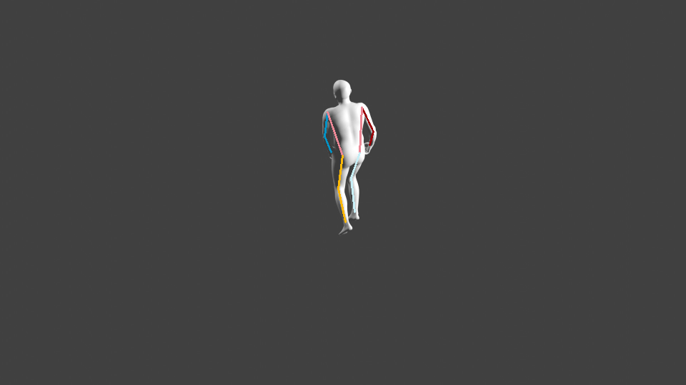
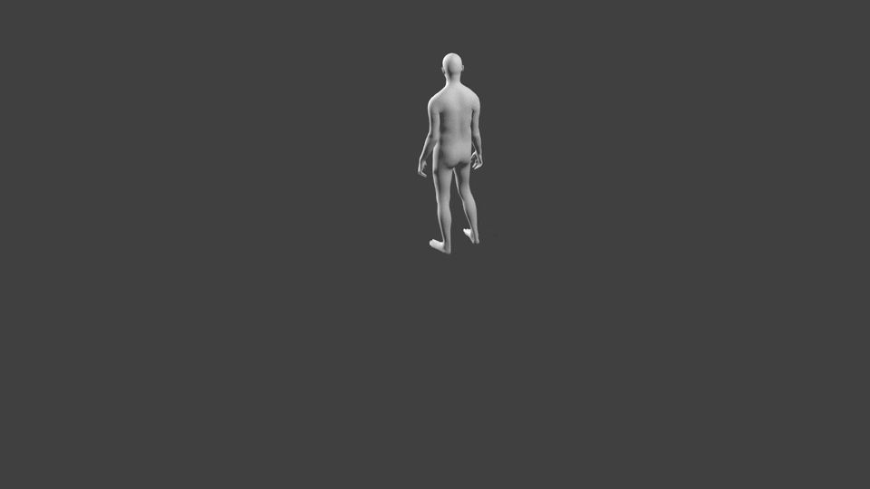
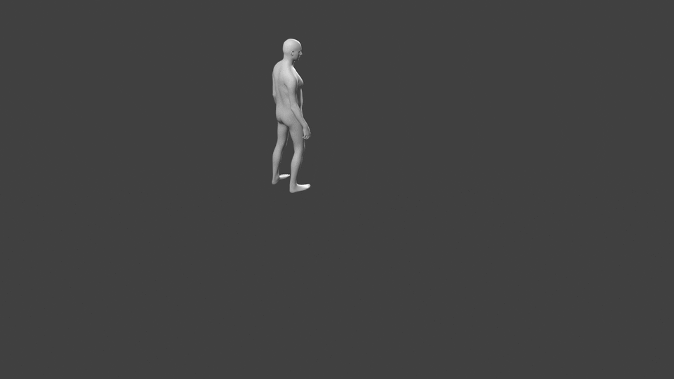
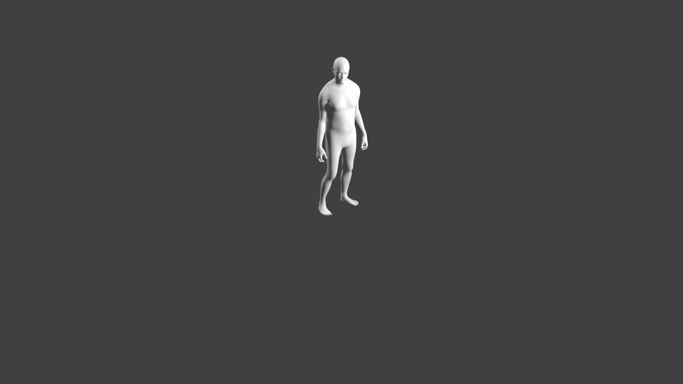
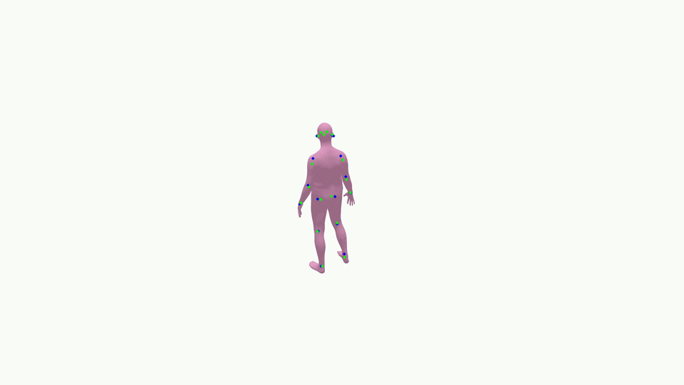
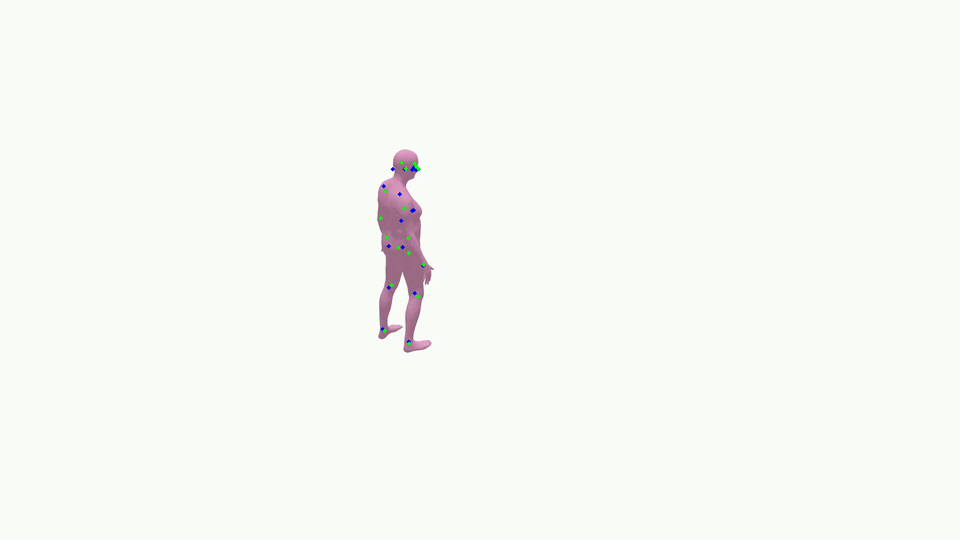
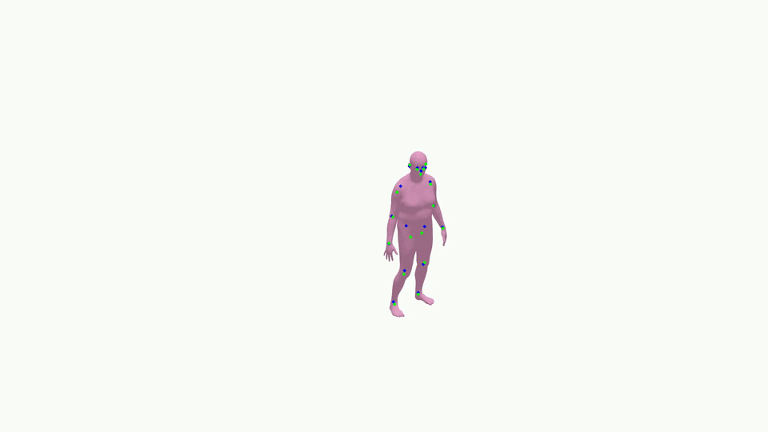
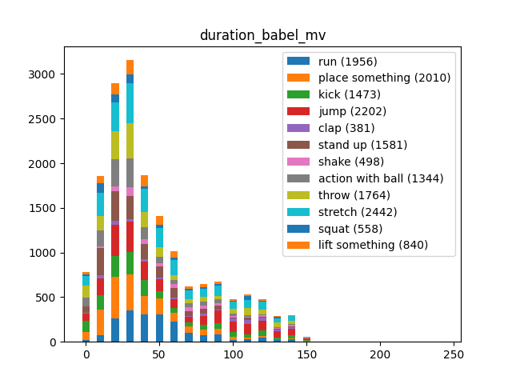
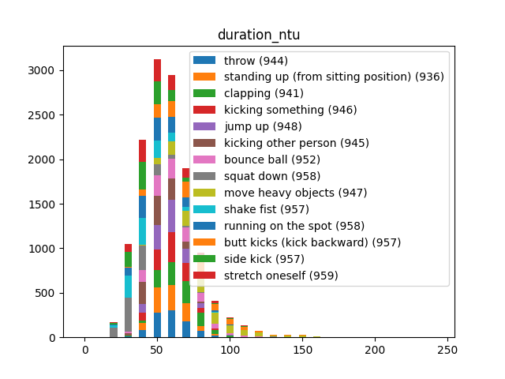

# babel-mv
babel dataset for multiview operations

## Data
12 classes : [Download](https://www.dropbox.com/scl/fi/jc97uk7fszw1k1mmoi3vo/babel_mv_0.2.pkl?rlkey=uns5suu5p5lpd8b2mf5w1gy10&st=0rco7rnh&dl=0)

## Generation

### Blender

Install smplx plugin on blender

Render sequences with :

`blender --python babel-mv/renderer/animation_renderer_blender.py`

This will display the three images side by side if the images are not too wide.

 

### Pyrender

`python render.py <MESHES_FOLDER_PATH> --convention='COCO' `

 

### visualize

Visualize video with estimated humand pose and ground truth

`python tools/visualize.py <RENDER_FOLDER_PATH>`

## Stats

Duration of sequences by action:
`python tools/data_plots.py <DATASET_FILE_PATH> --ntu <NTU_FILE_PATH>`

